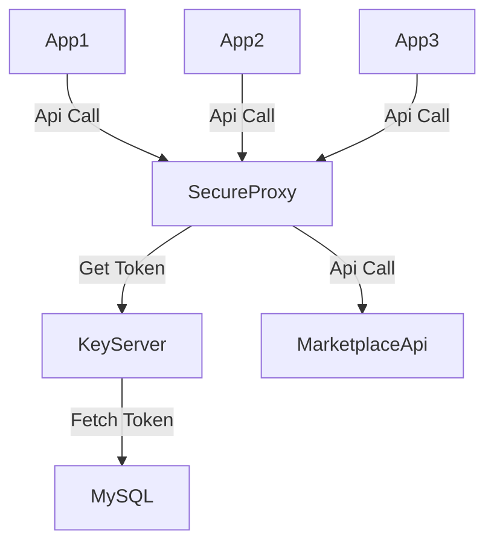

# SecureProxy-KeyServer

## Описание проекта

Проект состоит из двух Flask приложений: app1 и app2, которые взаимодействуют друг с другом для обработки запросов на получение и использование токенов, защищенных с использованием RSA и AES шифрования.

### Структура файлов

- `app1/`: Сервер для генерации и предоставления токенов.
  - app.py: Основной серверный код.
  - config.py: Конфигурационные параметры, включая ключи шифрования и настройки базы данных.
  - crypto_utils.py: Утилиты для работы с шифрованием (AES и RSA).
  - db.py: Модуль для подключения к базе данных MySQL.
  
- `app2/`: Клиент, запрашивающий токены у app1 и использующий их для запросов к внешним API.
  - app.py: Основной клиентский код.
  - config.py: Конфигурационные параметры для взаимодействия с app1.
  - crypto_utils.py: Утилиты для работы с шифрованием (AES и RSA).

## app1(KeyServer)

### app.py

Этот модуль реализует два основных маршрута:

- `/public_key` [POST]: Возвращает публичный RSA-ключ для клиента.
  - Функция: send_public_key()
  - Возвращает: Публичный ключ в формате PEM.

- `/` [POST]: Обрабатывает запросы на получение токенов.
  - Функция: handle_request()
  - Аргументы:
    - sessionKey: Сессионный ключ, зашифрованный с помощью RSA.
    - clientId: Идентификатор клиента.
    - tokenType: Тип запрашиваемого токена.
  - Возвращает: Зашифрованный токен, или ошибку при невозможности обработки.

### config.py

Конфигурационный файл, содержащий:

- RSA ключи: Генерация приватного и публичного ключей RSA.
- AES ключи: Загрузка ключа AES и IV (вектор инициализации) из файлов.
- Настройки базы данных: Параметры для подключения к MySQL базе данных.

### crypto_utils.py

Модуль с утилитами для работы с криптографией:

- `decrypt_aes_token()`: Расшифровывает токен с помощью AES.
- `decrypt_rsa_session_key()`: Расшифровывает сессионный ключ с помощью RSA.
- `encrypt_token()`: Шифрует токен с новым сессионным ключом AES для отправки клиенту.

### db.py

Модуль для работы с базой данных:

- `get_db_connection()`: Устанавливает соединение с MySQL базой данных на основе конфигурации.

## app2(SecureProxy)

### app.py

Этот модуль реализует один основной маршрут:

- `/request_api` [POST]: Запрашивает токен у app1, расшифровывает его и использует для обращения к внешнему API.
  - Функция: request_api()
  - Аргументы:
    - ClientId: Идентификатор клиента.
    - TokenType: Тип токена.
    - ApiUri: URI внешнего API, к которому будет осуществляться запрос.
  - Возвращает: Результат запроса к внешнему API.

### config.py

Конфигурационный файл для app2:

- `PUBLIC_KEY_URL`: URL для получения публичного ключа от app1.
- `TOKEN_REQUEST_URL`: URL для запроса токена у app1.

### crypto_utils.py

Модуль с утилитами для работы с криптографией:

- `generate_session_key()`: Генерирует случайный сессионный ключ.
- `encrypt_session_key()`: Шифрует сессионный ключ с использованием публичного RSA ключа.
- `decrypt_token()`: Расшифровывает токен, полученный от app1.

## Диаграмма взаимодействия компонентов (Mermaid)

## Параметы для запуска проекта:
1. В `app1/app1.py` в 76 строке кода вместо '_' необходимо вставить название таблицы с токенами клиентов
2. В  `app1/config.py` в db_config необходимо ввести соответствующие параметры базы данных с токенами
3. При необходимости введите в `app1.py` и `app2.py` port и host. В этом случае в `app2.config.py` задайте port и host app1
